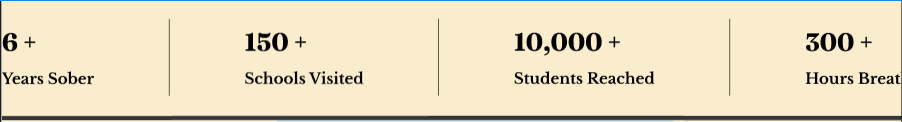

This is a [Next.js](https://nextjs.org) project bootstrapped with [`create-next-app`](https://nextjs.org/docs/app/api-reference/cli/create-next-app).

## Getting Started

First, run the development server:

```bash
npm run dev
# or
yarn dev
# or
pnpm dev
# or
bun dev
```

Open [http://localhost:3000](http://localhost:3000) with your browser to see the result.

You can start editing the page by modifying `app/page.tsx`. The page auto-updates as you edit the file.

This project uses [`next/font`](https://nextjs.org/docs/app/building-your-application/optimizing/fonts) to automatically optimize and load [Geist](https://vercel.com/font), a new font family for Vercel.

## Learn More

To learn more about Next.js, take a look at the following resources:

- [Next.js Documentation](https://nextjs.org/docs) - learn about Next.js features and API.
- [Learn Next.js](https://nextjs.org/learn) - an interactive Next.js tutorial.

You can check out [the Next.js GitHub repository](https://github.com/vercel/next.js) - your feedback and contributions are welcome!

## Deploy on Vercel

The easiest way to deploy your Next.js app is to use the [Vercel Platform](https://vercel.com/new?utm_medium=default-template&filter=next.js&utm_source=create-next-app&utm_campaign=create-next-app-readme) from the creators of Next.js.

Check out our [Next.js deployment documentation](https://nextjs.org/docs/app/building-your-application/deploying) for more details.




let me give you more specific details as to what we need in the user flow, lets say I see a setup then I go to the applicaiton, there it asks me the questions before the entry, if i successfully answer those then only it proceeds ahead where the ai now based on my setup analyzes the score of it being successfull and whether or not is it a good setup now even if the score is low I should be able to make the trade only time i wont be not able to make the trade is when i dont get a 70-80% score in the pre entry questions, now after ai has calculated the score I should have the option to either make the ai/platform execute the trade using api's or mcp server or i can do it manually now once i have made the trade the ai should be able to monitor the trade from the trading platforms api and should stop the trade when sl reached if i havent done it manually, it should also have an access to my trade history again using the trading platform using which it should aid my further decisions whether or not to trade and hows everything been going, do you now have a better understanding of what iam tring to make? based on this update the design document you may use your own understanding as well